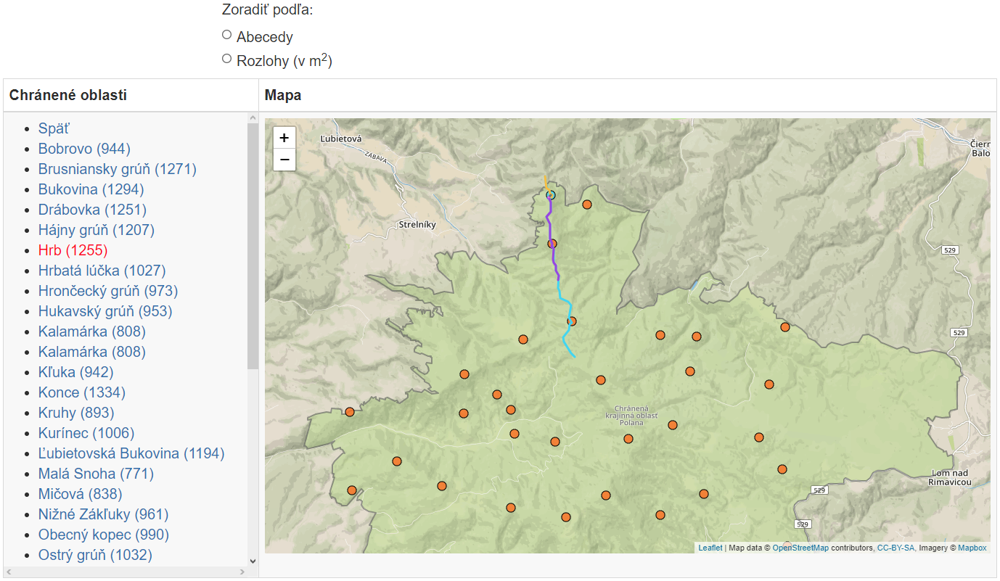

# Overview

Aplikácia zobrazuje chránené oblasti a národné parky, vrchy v rámci nich a cesty, ktorými cez vybraté vrchy prejsť.<br/>
Používateľ má možnosť:
* zoradiť oblasti podľa rozlohy (a abecedne)
* zoradiť vrchy podľa nadmorskej výšky (a abecedne)
* po vybratí si vrchu zobraziť možné cesty popri ňom (farebne odlíšené, ak je ciest viac) a nájsť aj iné vrchy, ktoré danou cestou navštívi



Ako webová aplikácia je štandardne stavaná na častiach frontend a backend.<br/>
Frontend používa Bootstrap, JQuery a Leaflet pre zobrazenie mapy. S backendom komunikuje cez AJAX.<br/>
Backend používa NodeJS a ExpressJS. Napája sa na PostGIS a geografické výsledky vracia v geoJson formáte.<br/>

# Frontend

Celá frontendová stránka sa nachádza v jednom súbore (`index.html`). Tam je vidieť navigácia vytvorená pomocou Bootstrapu a mapa využívajúca LeafletJS.<br/>
K tomu je využívané vlastné CSS v súbore (`styles/style.css`). <br/>
Boostrap CSS je stiahnutý a nachádza sa v súbore (`styles/bootstrap.min.css`). <br/>
Bootstrap JS je v súbore (`js/lib/bootstrap.min.js`).<br/>
Vlastný frontend Javascript kód je v súbore (`js/app.js`). <br/>
Stará sa o:
* volania na backend cez AJAX
* zachytávanie používateľových vstupov v mape a v navigačnom menu
* upravovanie navigačného menu
* zobrazenie nových údajov po ich vrátení z backendu

# Backend

Backend je postavený na technológii NodeJS a ExpressJS a využíva ich základné knižnice.<br/>
Javascript kód sa nachádza v súbore (`js/server.js`).<br/>
Zabezpečuje:
* endpointy pre volania z frontendu
* pripojenie na lokálnu PostGIS databázu
* vrátenie výsledkov (geografické údaje sú vo formáte geoJson)

## Data

Dáta o Slovensku sú stiahnuté z adresy `https://download.geofabrik.de/europe.html`, kde je možné získať Open Street Map údaje pre jednotlivé krajiny. Aplikácia obsahuje iba údaje pre Slovensko.<br/>
Bolo potrebné ich importovať do databázy pomocou nástroja `osm2pgsql`. Aplikácia využíva všetky 3 tabuľky `planet_osm_point`, `planet_osm_line` a `planet_osm_polygon`.<br/>
Geografické údaje zo stĺpca `way` sú do formátu geojson transformované priamo v query, pomocou štandardnej funkcií `st_transform` (do srid = 4326) a `st_asgeojson`.

## Api

**Nájdi všetky chránené oblasti na území SR**
<br/>`GET /natural_parks`<br/>
Toto API funguje bez parametrov, nakoľko je cieľom dopytu vždy zobraziť celé Slovensko.

**Nájdi všetky vrchy vnútri zvolenej oblasti**
<br/>`GET /peaks`<br/>
Parametre:
* `osm_id` - ID vybratej oblasti

**Nájdi cesty vedúce k danému vrchu**
<br/>`GET /paths`<br/>
Parametre:
* `osm_id` - ID vybratého vrchu

### Response

Každé volanie vracia dáta v podobnom formáte v závislosti na scenári. <br/>
Príklad:<br/>
```
[{
  "osm_id": -45619818,
  "name": "Hrb",
  "ele": 1255,
  "geojson": { ... }
}]
```

Ako z príkladu vyplýva, každá odpoveď je v tvare poľa, nakoľko vždy (ak zrovna daný prípad nemá iba jeden výskyt) je potrebné vrátiť viac ako jeden záznam. jednotlivé záznamy v rámci poľa majú najprv žiadané atribúty ako id, meno a pod., a následne atribút geojson, kde je v tvare platného geojsonu stĺpec `way` z PostGISu.
